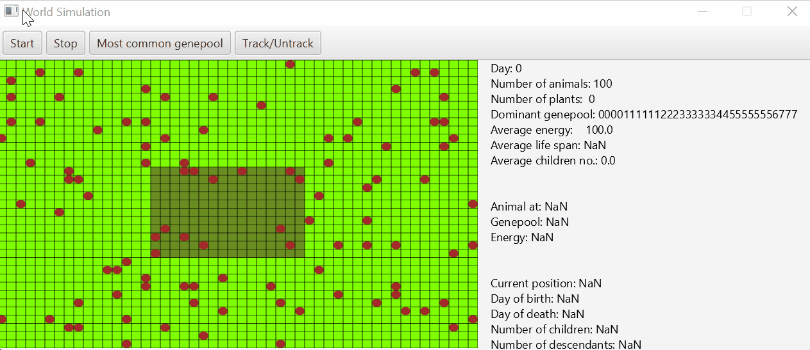

# Animal Simulation

This project was created for an Introduction to Object Oriented Programming class at AGH University of Science and Technology. It simulates a population of 'animals' on a plain, which is divided into a jungle (centre part) and a prairie. Each day a new plant grows in both of them.

The animals compete with each other for food in order to survive. Their movement is based on their 32-byte genotype, from which the next step is chosen randomly.

If two animals meet each other in one cell and their energy is high enough they can produce offspring that inherits parts of genotypes of its parents while also leaving room for mutations.

Statistics of the simulation are displayed on the right side of the screen. Additional abillities of highlighting animals with the most common genotype or tracking a specific animal have also been implemented.

# Technology

* Java
* JavaFX for visualisation
